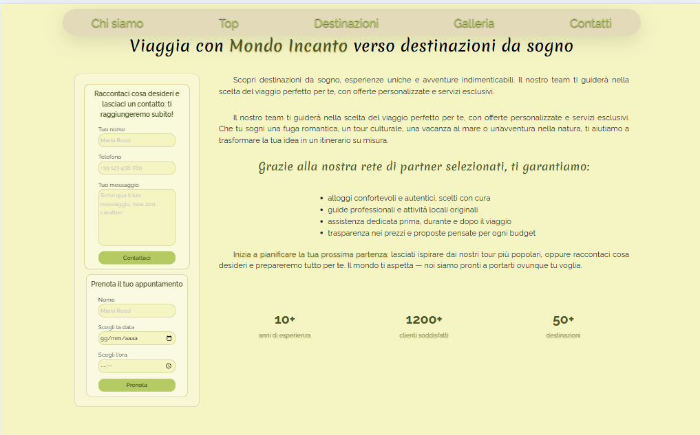
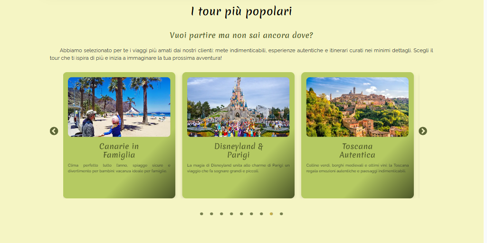
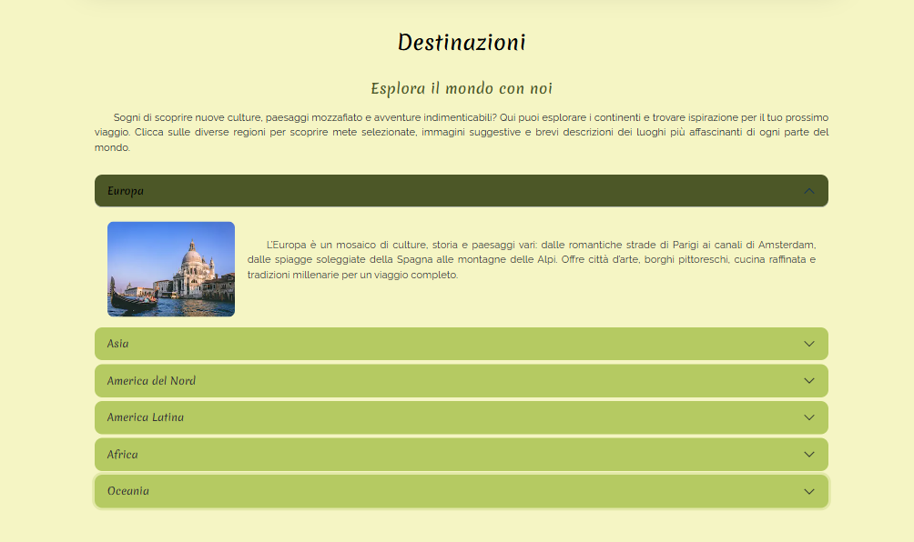
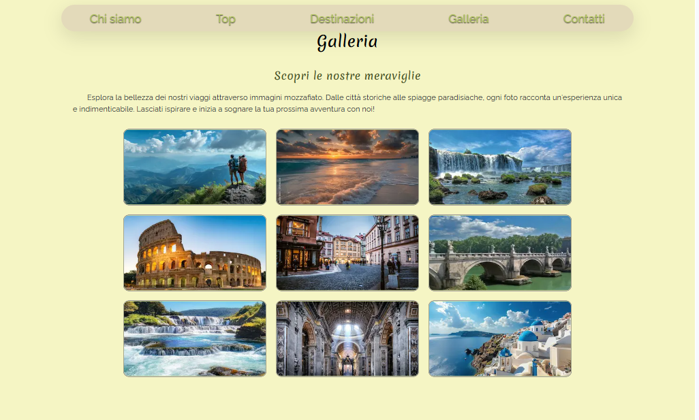
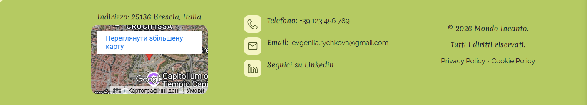
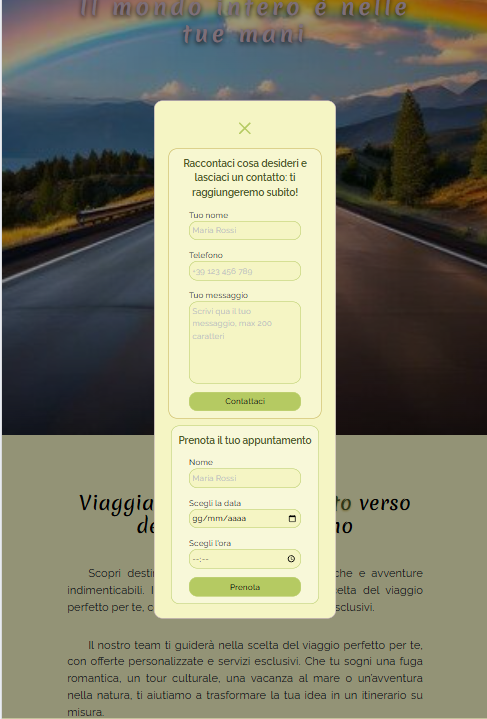

# Agenzia di viaggi – Mondo Incanto

Sito web responsive per un’agenzia di viaggi, progettato e sviluppato autonomamente.
Il progetto include design personalizzato, struttura frontend e componenti interattivi.
Il sito è completamente responsive, progettato sia per desktop che per dispositivi mobili. 
Il contenitore principale ha larghezza fissa di 1200px per desktop e 768px per tablet/smartphone, 
garantendo un layout coerente su diverse risoluzioni.

---

## Tecnologie
* HTML5
* CSS3
* JavaScript
* Bootstrap
* jQuery
* Slick Carousel
* JSON (dati per la carousel dei tour)

---

## Funzionalità
* Layout **mobile-first** e completamente responsive
* Navbar con hamburger menu su mobile
* Sidebar:
  * modale su dispositivi mobili
  * fissa su desktop
* Carousel dei tour con dati caricati da file JSON
* Gestione dei colori e font tramite CSS variables
* Animazioni leggere per migliorare l’esperienza utente

---

## Ottimizzazione immagini e icone

Tutte le immagini del sito sono ottimizzate in **WebP e adattive** per desktop e mobile. Le icone sono gestite tramite uno **sprite ottimizzato**, garantendo un sito veloce e responsive.

---

## Contenuti
I testi del sito sono originali e scritti per questo progetto.
Le immagini e le fotografie provengono da **fonti aperte** (open source / stock gratuiti).

---

## Screenshot

---

## Link
Il progetto è disponibile online:
* **GitHub:** https://github.com/Ievgeniia23/Agenzia-viaggi
* **GitHubPages:** https://ievgeniia23.github.io/Agenzia-viaggi/
* **Live demo (Vercel):** https://agenzia-viaggi-jet.vercel.app/

---

## Autore
Progetto realizzato da **Ievgeniia Rychkova (ievgeniia.rychkova@gmail.com)**  
Design, sviluppo frontend e contenuti testuali a cura dell’autore.
